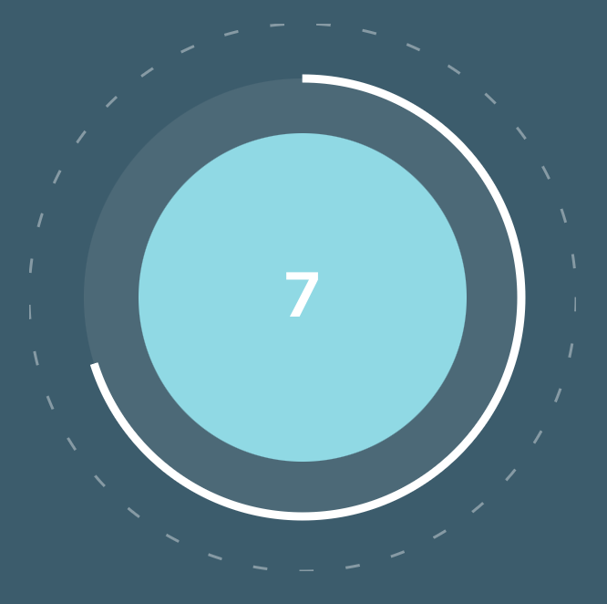

# Usage
### Widget 1
<!-- {"width":155} -->
```
<Widget1 size={200} />
```

### Widget 2
<!-- {"width":159} -->
```
<Widget2
	width={200}
	defaultValue={4}
	showStatus={true} />
```

### Linear Slider
<!-- {"width":254} -->
```
const [value, setValue] = useState(0)

<LinearSlider
	width={200}
	max={10}
	value={value}
	setValue={setValue} />
```

### Circular Progress
<!-- {"width":163} -->
```
const [value, setValue] = useState(0)

<CircularProgress
	size={200}
	value={value}
	setValue={setValue}
	parentStyle={{ marginBottom: "30px" }}
	percentage={(value / 10) * 100} />
```

# Options
### Widget 1
| Property | Type | Description                 | Default |
|----------|------|-----------------------------|---------|
| size     | Int  | Size of the widget          | 200     |
| max      | Int  | Maximum value of the slider | 100     |
| min      | Int  | Minimum value of the slider | 0       |

### Widget 2
| Property     | Type    | Description                                    | Default |
|--------------|---------|------------------------------------------------|---------|
| width        | Int     | Size of the widget                             | 200     |
| defaultValue | Int     | Default value of the widget (0-4)              | 0       |
| showStatus   | Boolean | To display the status text (Low, Medium, High) | true    |

### Linear Slider
| Property | Type     | Description                 | Default |
|----------|----------|-----------------------------|---------|
| width    | Int      | Width of the widget         | 200     |
| min      | Int      | Minimum value of the slider | 0       |
| max      | Int      | Maximum value of the slider | 100     |
| value    | Int      | Value of the widget         | -       |
| setValue | Function | function with 1 parameter   | -       |

### Circular Progress
| Property    | Type | Description                       | Default |
|-------------|------|-----------------------------------|---------|
| size        | Int  | Size of the widget                | 200     |
| value       | Int  | Value of the widget               | 0       |
| percentage  | Int  | Percentage of the progress circle | 0       |
| strokeWidth | Int  | Width of the progress circle      | 3       |
